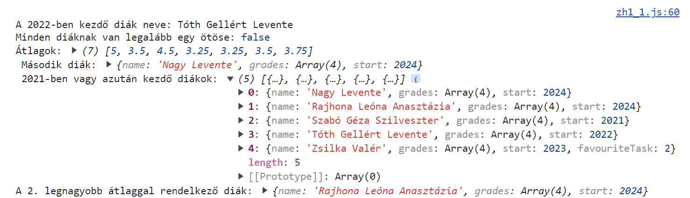
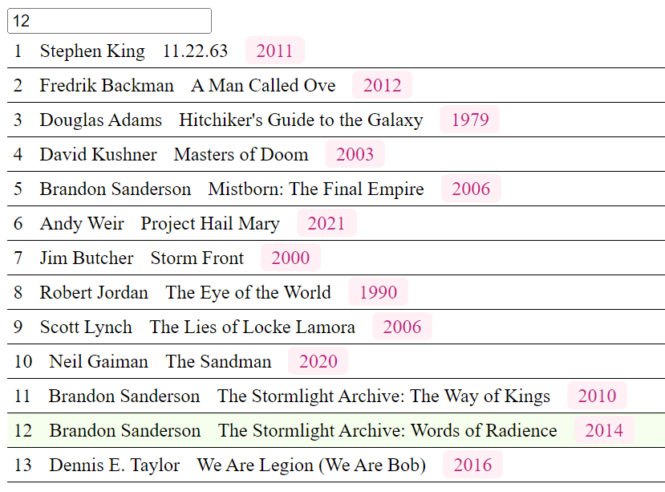

# Webprogramozás 2024-2025-1 JavaScript ZH

Az eredményeket küldjétek a `babuafi@inf.elte.hu` e-mail címre.

## 1. feladat



Adott egy tömb (`students`) a diákok ZH eredményével.

A diákokról a következő adatokat tároljuk:
- name: A diák neve.
- grades: A diákok dolgozatokra elért eredménye. Minden diák pontosan 4 dolgozatot írt.
- start: Az év amikor a diák a képzést kezdte.

Az alábbi alfeladatok eredményét írasd ki a console-ra.
A `console.log` parancs és a változók már adottak, csak töltsd ki őket a megfelelő értékekkel.

1.1 **Keresd meg azt a diákot aki 2022-ben kezdett és írasd ki a nevét (és csak a nevét!).** (1 pont)

1.2 **Döntsd el, hogy minden diák kapott-e legalább egy ötöst.** (1 pont)

1.3 **Írasd ki egy tömbben a diákok átlagát (tehát a `grades` tömb átlagát minden diák esetén).** (1 pont)

A kiíratott tömb hossza tehát egyezni fog a `students` tömb hosszával.

    Segítség:

    Átlagszámítás emlékeztető:
    Egy számokat tartalmazó tömb átlagát úgy tudod kiszámolni, ha összeadod az összes számot, majd elosztod a tömb
    méretével (másképp megfogalmazva HOSSZával).

    Példa:
    [1, 1, 2, 4, 5]
    átlaga:
    (1 + 1 + 2 + 4 + 5) / 5 = 2.6

1.4 **Rendezd ABC rendbe a diákok listáját és írasd ki a 2. diákot.** (1 pont)

Olyan összehasonlítási módot használj, amely működne ékezetes karakterek esetén is!

1.5 **Írasd ki a diákok nevét akik 2021-ben vagy azután kezdték a képzést.** (1 pont)

+1 **Írasd ki a 2. legjobb (legmagasabb) átlaggal rendelkező diákot.** (1 pont)


## 2. Feladat



A fájlok között találsz egy `books.js` nevű fájlt, ebben könyvek listáját találod egy `books` nevű változóban.
Ez a változó már **be** van importálva a `zh1_2.html` fájlban, így egyből tudod is használni a `zh1_2.js`-ben.

A könyvekről a következő adatokat tároljuk:
- id: A könyv egyedi azonosítója. Tekinthetsz rá indexként is.
- title: A könyv címe.
- author: A könyv szerzője.
- release: A könyv megjelenésének éve.

2.1 **Lépkedj végig a `books` tömb elemein és jelenítsd meg a könyvek adatait.** (2 pont)

Erre használd a következő struktúrát (természetesen az adott könyv adataival kitöltve, a példában az 1. könyv szerepel):

```
<div id="book-1" class="row">
    <div>1</div>
    <div>Stephen King</div>
    <div>11.22.63</div>
    <div>
        <span class="year">2011</span>
    </div>
</div>
```

Az id (fenti blokk első sora) a `book-` előtaggal kezdődjön és a könyv azonosítójával (`id`) végződjön.

A szükséges osztályok már létre lettek hozva a `zh1.css` fájlban, így itt plusz dolgod nincs.

Nem szükséges, de ha segít a következő feladatok megoldásában, a fenti struktúrát nyugodtan egészítsd ki extra attribútumokkal!

A létrehozott HTML kódot a `container` azonosítójú elembe szúrd a helyes megjelenítéshez.

    Segítség:
    A legegyszerűbb megoldás egy tömb függvénnyel létrehozni az egész HTML-t, azonban ha for ciklust használnátok
    fontos tudni, hogy a DOM elemek tartalma nem csak felülírható hanem bővíthető is, ha a végére írjátok a új
    tartalmat.
    
    Segítség:
    Backtick (`) használatával többsoros sztringet is létre tudtok hozni.
    
    Segítség:
    A tömb `join` függvénye használható arra, hogy egy sztringeket tartalmazó tömböt összefűzz egyetlen sztringgé.

2.2 **A felületen találsz egy input mezőt.
Amikor a felhasználó az input mező értékén változtat, validáld, hogy a megadott szám legalább 1, de nem nagyobb mint a könyvek száma (13).** (1 pont)

A 13-as számot ne égesd direktben a kódba, a validáció működjön akkor is ha bővítjük a `books` tömböt további elemekkel.

Ha a validáció nem teljesül - vagy nem is szám szerepel a mezőben például mert üres - az `error` azonosítójú elembe írd ki a következő szöveget:

`A megadott azonosítójú könyv nem létezik, kérjük adjon meg egy másik azonosítót.`

Ha a hiba megszűnik, az üzenet is tűnjön el!

2.3 **Amennyiben helyes azonosító került megadásra, a megfelelő azonosítójú (indexű) könyv sora kerüljön kiemelésre.** (1 pont)

Ehhez annyit kell tenned, hogy a megfelelő `row` osztállyal rendelkező elemre rárakod a `selected` osztályt.

2.4 **Az input mező értékének változásakor távolítsd el a korábbi kijelöléseket.** (1 pont)

Ez történjen meg akkor is ha nem megfelelő azonosító van megadva éppen.

